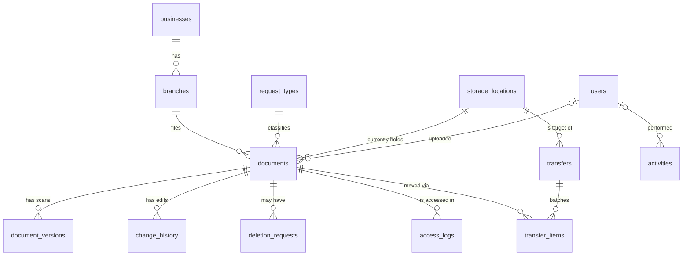

# Data Model — File Management System

> Derived from [PLAN.md](PLAN.md) §6. Design-stage reference; no migrations exist yet.
> Target: **MySQL 8** (InnoDB, utf8mb4). Produced 2026-07-22.

**Storage principle:** scanned files live on the server's **private disk** (Laravel `Storage`, `storage/app/private`). The database stores **only the file path** — never the file bytes (no BLOBs). Files are served through an **authenticated route**, never a public URL (§3.5, §3.6, §7.5).

**Conventions:** every table has a `BIGINT UNSIGNED` auto-increment `id` primary key and `created_at`/`updated_at` timestamps unless noted. "FK cascade" = foreign key with `ON DELETE CASCADE`; "FK nullOnDelete" = `ON DELETE SET NULL`. "Soft deletes" = a nullable `deleted_at`.

---

## Two different "locations" — read this first

The word *location* means two unrelated things in this system. Keeping them separate is essential:

| Concept | Where it lives | Meaning |
|---|---|---|
| **Branch location** | `branches.location` | The **business's physical address** — part of *filing* and *search* (§6.8). "McDonald's – Rizal St." |
| **Storage location** | `storage_locations` + `documents.storage_location_id` | Where the **paper original currently physically sits** — for retrieval (§3.4). "In Office" / "Central Storage Building." |

A document's *branch* never changes because the business moved; its *storage location* changes every time the paper is transferred.

---

## Entity overview

---

## Core hierarchy

### `users` (extends the starter kit)

Starter-kit columns (id, name, email, password, 2FA, passkeys) plus:

| Column | Type | Notes |
|---|---|---|
| `role` | ENUM(`viewer`,`editor`,`admin`) | Flat, **one global role per user** — no teams/departments (§6.4) |
| `is_active` | BOOLEAN, default true | Deactivation logs the user out on next request; account is **never deleted**, to preserve attribution (§6.5) |

Password recovery: email (SMTP) or admin-set temporary password (§6.5).

### `businesses`

| Column | Type | Notes |
|---|---|---|
| `name` | VARCHAR | Controlled vocabulary; typeahead-suggested (§3.3) |
| | soft deletes | Retired by **merge** (below) |

May exist with **zero branches** — the "known business, nothing encoded" state (§6.1, §6.2).

### `branches` — the filing unit

| Column | Type | Notes |
|---|---|---|
| `business_id` | FK cascade | Parent business. **Re-parentable** — correcting a mis-filed branch updates this one row and all its documents follow (§6.7) |
| `location` | VARCHAR | The business's address; typed-with-suggestion (§6.8) |
| | soft deletes | Retired by merge |

Index: (`business_id`). May exist with zero documents.

### `request_types`

| Column | Type | Notes |
|---|---|---|
| `name` | VARCHAR | Controlled vocabulary; selection at encoding (§6.8); mergeable |
| | soft deletes | |

### `storage_locations`

| Column | Type | Notes |
|---|---|---|
| `name` | VARCHAR | e.g. "In Office", "Central Storage Building" |

Seeded at install; extensible to more physical sites later. This is the paper's **current whereabouts**, not the business address.

### `documents`

| Column | Type | Notes |
|---|---|---|
| `reference` | CHAR/UUID, **unique** | **Opaque external identity** — encoded in the QR and used by the app/API (§6.9). The integer `id` is internal and never leaves the server |
| `branch_id` | FK | Filing unit. **Business is derived through the branch — there is no `business_id` here** |
| `request_type_id` | FK | |
| `storage_location_id` | FK | Current physical whereabouts of the paper |
| `approval_date` | DATE, nullable | **Primary sort/search date** (§6.8) |
| `request_date` | DATE, nullable | Fallback date, used only when no approval date (§6.8, §8.9) |
| `title` | VARCHAR, nullable | Free-text subject/person/entity; optional |
| `scan_date` | TIMESTAMP | **Automatic**, never typed, never sorted on — audit only |
| `uploaded_by` | FK nullOnDelete | |
| `is_hidden` | BOOLEAN, default false | Set true while a deletion request is pending (§6.7); removes from search without deleting |
| | soft deletes | Approved deletion soft-deletes; purged after 90 days |

**No file columns** — the current scan is the `document_versions` row where `is_current = true`.
Indexes: `reference` (unique), `branch_id`, `request_type_id`, `approval_date`.

---

## History & lifecycle

### `document_versions`

Every scan, current and superseded, lives here (§6.7 — file replacement keeps history).

| Column | Type | Notes |
|---|---|---|
| `document_id` | FK cascade | |
| `path` | VARCHAR | Location on the private disk — **not** a public URL |
| `original_name` | VARCHAR | |
| `size`, `mime_type` | | |
| `is_current` | BOOLEAN | Exactly one true per document (enforced in app logic) |
| `uploaded_by` | FK nullOnDelete | |
| `created_at` | | (no `updated_at` — versions are immutable) |

**Retention:** superseded versions (`is_current = false`) are auto-purged 90 days after replacement; the current version is never purged (§6.7).

### `change_history`

Structured field-level before/after that **powers revert** (§6.7). Deliberately separate from `activities` so a data-restoring operation never depends on an audit log's format.

| Column | Type | Notes |
|---|---|---|
| `document_id` | FK cascade | |
| `field` | VARCHAR | Which metadata field changed |
| `old_value` | TEXT, nullable | |
| `new_value` | TEXT, nullable | |
| `changed_by` | FK nullOnDelete | |
| `is_revert` | BOOLEAN | Marks a row that was itself a revert |
| `created_at` | | |

Revert is permitted to the **original editor**, or to an **admin** as fallback when that editor is deactivated (§6.7).

### `deletion_requests`

| Column | Type | Notes |
|---|---|---|
| `document_id` | FK cascade | |
| `requested_by` | FK | |
| `reason` | TEXT | Mandatory justification (§6.7) |
| `status` | ENUM(`pending`,`approved`,`rejected`) | |
| `approved_by` | FK nullable | The office head/admin who decided |
| `decided_at` | TIMESTAMP, nullable | |

On **pending** → `documents.is_hidden = true`. On **rejected** → `is_hidden = false`. On **approved** → soft-delete the document (90-day window, then auto-purge). Hiding is a workflow-produced state, never a user action (§6.7).

---

## Physical transfers

### `transfers` (batch header)

| Column | Type | Notes |
|---|---|---|
| `to_storage_location_id` | FK | Target location for the batch |
| `performed_by` | FK | Editor/admin who ran the transfer (via app or web) |
| `note` | VARCHAR, nullable | |
| `transferred_at` | TIMESTAMP | |

### `transfer_items`

| Column | Type | Notes |
|---|---|---|
| `transfer_id` | FK cascade | |
| `document_id` | FK | |
| `from_storage_location_id` | FK nullable | The location the document left |

Each item updates its `documents.storage_location_id` to the transfer's target and writes an `activities` row. A **single-document** transfer is simply a batch with one item — so "per document" and "batch" (§6.9) share one model.

---

## Logs

### `activities` — accountability, append-only

| Column | Type | Notes |
|---|---|---|
| `user_id` | FK nullOnDelete | |
| `subject_type`, `subject_id` | polymorphic | Points at any entity — document, branch, business, request type, user, transfer |
| `action` | VARCHAR | e.g. `document.uploaded`, `branch.merged`, `branch.reparented`, `document.transferred`, `deletion.approved`, `user.deactivated` |
| `details` | JSON, nullable | Context (e.g. merge source/target ids) |
| `created_at` | | No `updated_at` — append-only |

**Read-only by design.** Nothing in the application acts on `activities`; it exists to answer "who did what, when." Merges, re-parents, and transfers must all write here because each silently affects many documents.

### `access_logs` — document serving (high volume)

| Column | Type | Notes |
|---|---|---|
| `user_id` | FK | |
| `document_id` | FK | |
| `action` | ENUM(`view`,`download`,`print`) | Recorded when the PDF is served (§6.6) |
| `created_at` | | |

Separated from `activities` for volume and independent retention — views are frequent and may warrant a shorter life than mutation records (§6.6).

### `search_logs` — success measurement

| Column | Type | Notes |
|---|---|---|
| `user_id` | FK | |
| `query` | VARCHAR | What was searched |
| `result_count` | INT | How many results returned |
| `opened_document_id` | FK nullable | Which result (if any) was opened — the hit/miss signal |
| `created_at` | | |

Feeds the **60% hit-rate** metric (§5.3). A row with `opened_document_id = null` is a probable miss.

---

## Cross-cutting rules

1. **Business is always derived through the branch** — never stored on the document. One source of truth; re-parenting and merges just work.
2. **`reference` is the only external identity.** QR codes, the API, and any client-facing link use the opaque token; the integer `id` never leaves the server (§6.9).
3. **Merge** (business, branch, request type — all three, §6.7): re-point the duplicate's children to the survivor, retire the duplicate (soft delete), and log the merge in `activities`. Branch merge also handles the re-parent collision case (§6.7).
4. **90-day retention**, auto-purged on a schedule, no manual purge button: superseded `document_versions` and soft-deleted `documents` (§6.7).
5. **Files on disk, paths in the DB, served authenticated.** No BLOBs, no public URLs.

---

## Still open (see PLAN.md §10)

- Exact `reference` token format (length/algorithm) and QR encoding.
- API request/response payload shapes for the app (endpoints are fixed in §6.9).
- Retention period for `access_logs` / `search_logs` (distinct from the 90-day document rule).
- The final date sort key when a document has neither approval nor request date (§8.9).
- Whether retired (merged/soft-deleted) vocabulary rows are ever hard-deleted or kept indefinitely.
