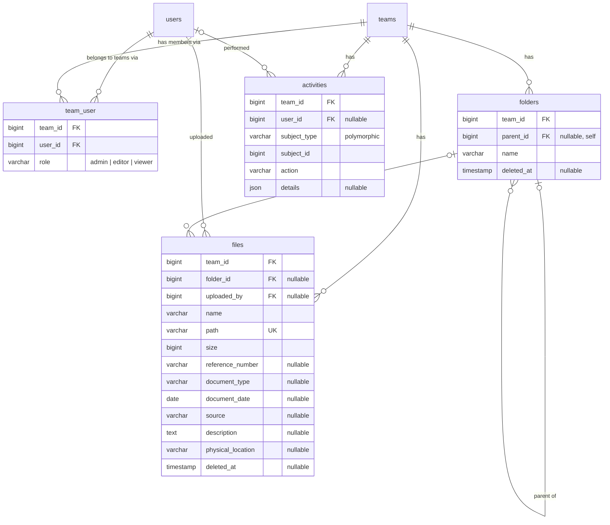

# Database Schema

> Derived from [PLAN.md](PLAN.md) §3 Design, finalized 2026-07-16 after a schema review session.
> Target: MySQL 8 (InnoDB, utf8mb4). This is the design reference — no migrations exist yet.

**Conventions:** every table has a `BIGINT UNSIGNED` auto-increment `id` primary key and `created_at`/`updated_at` timestamps unless noted. "FK, cascade" = foreign key with `ON DELETE CASCADE`.

## Entity overview

## Tables

### users (existing starter-kit table, extended)

| Column | Type | Notes |
|---|---|---|
| name, email, password, remember_token, two-factor + passkey columns | — | existing starter-kit columns; `email` unique |
| **is_admin** | BOOLEAN NOT NULL DEFAULT FALSE | super-admin: manages accounts and departments globally |
| **is_active** | BOOLEAN NOT NULL DEFAULT TRUE | FALSE = deactivated; middleware logs the user out. Account (and upload history) is preserved |
| **active_team_id** | BIGINT UNSIGNED NULL · FK → teams · ON DELETE SET NULL | the department the user is currently working in |

### teams

A department.

| Column | Type | Notes |
|---|---|---|
| name | VARCHAR(255) NOT NULL | department name |

### team_user

Membership + per-department role. Authorization keys off `role`; there is no separate "owner".

| Column | Type | Notes |
|---|---|---|
| team_id | FK → teams, cascade | |
| user_id | FK → users, cascade | |
| role | VARCHAR(20) NOT NULL DEFAULT 'editor' | `admin` \| `editor` \| `viewer` — validated by a PHP enum, not a DB enum |

Constraints: `UNIQUE (team_id, user_id)`. Application guard: a team must always retain at least one `admin`.

### folders — soft deletes

DB-only folder tree; nothing on disk corresponds to a folder.

| Column | Type | Notes |
|---|---|---|
| team_id | FK → teams, cascade | |
| parent_id | BIGINT UNSIGNED NULL · self-FK, cascade | NULL = root of the department |
| name | VARCHAR(255) NOT NULL | |
| deleted_at | TIMESTAMP NULL | a deleted subtree shares one `deleted_at` value (restore groups by it) |

Indexes: `(team_id, parent_id)`.
Note: sibling-name uniqueness is enforced in Form Request validation, **not** a DB unique constraint — a nullable `parent_id` plus soft deletes make a composite unique unreliable in MySQL.

### files — soft deletes

One scanned document.

| Column | Type | Notes |
|---|---|---|
| team_id | FK → teams, cascade | |
| folder_id | BIGINT UNSIGNED NULL · FK → folders, cascade | NULL = root |
| uploaded_by | BIGINT UNSIGNED NULL · FK → users · ON DELETE SET NULL | |
| name | VARCHAR(255) NOT NULL | display name incl. extension; collisions auto-suffixed ` (1)` |
| path | VARCHAR(255) NOT NULL UNIQUE | disk location: `teams/{team_id}/{hashName}` |
| size | BIGINT UNSIGNED NOT NULL | bytes |
| mime_type | VARCHAR(255) NULL | |
| reference_number | VARCHAR(100) NULL | official control number (e.g. "Memo No. 2025-014"); searchable |
| document_type | VARCHAR(50) NULL | value from the `config/files.php` list (Letter, Memo, Minutes, Report, Contract, Other) |
| document_date | DATE NULL | the date written on the document |
| source | VARCHAR(255) NULL | originating office/person; free text with UI autocomplete from the team's existing values |
| description | TEXT NULL | searchable free text |
| physical_location | VARCHAR(255) NULL | cabinet/box where the paper original lives |
| deleted_at | TIMESTAMP NULL | |

Indexes: `(team_id, folder_id)`, `(team_id, name)`, `(team_id, reference_number)`, `(team_id, document_type)`, `(team_id, document_date)`.
Search (`?q=`) matches `name`, `reference_number`, `source`, `description`; `?type=` filters on `document_type`.

### activities — append-only audit log (`created_at` only; no `updated_at`, no soft deletes)

Records **mutations only** — downloads/views are deliberately not logged (volume + retention stays trivial; decision from the 2026-07-16 review).

| Column | Type | Notes |
|---|---|---|
| team_id | FK → teams, cascade | scope for listing a department's activity |
| user_id | BIGINT UNSIGNED NULL · FK → users · ON DELETE SET NULL | who performed the action |
| subject_type | VARCHAR(255) NOT NULL | polymorphic: `File`, `Folder`, `Team` (membership events) |
| subject_id | BIGINT UNSIGNED NOT NULL | |
| action | VARCHAR(50) NOT NULL | `uploaded`, `renamed`, `moved`, `metadata_updated`, `trashed`, `restored`, `force_deleted`, `trash_emptied`, `member_added`, `member_removed`, `role_changed` |
| details | JSON NULL | context that survives the subject's deletion, e.g. `{"name": "budget-letter.pdf", "from": "Drafts", "to": "2025/March"}` |

Indexes: `(team_id, created_at)`, `(subject_type, subject_id)`.

## Design rationale (decisions from review)

- **`reference_number` exists** because staff request documents by control number; burying it in `description` would make it unsearchable as a field.
- **`source` is free text, not a lookup table** — UI autocomplete over the team's existing values herds spelling toward consistency without adding a table, admin UI, and encoding friction.
- **Activity log covers mutations only** — logging downloads would multiply rows ~100× and force a retention policy; reopening that decision requires revisiting retention, not just adding a log call.
- **`document_type` is a validated varchar, not a FK** — the list lives in `config/files.php`; renaming a type later leaves historical rows with the old string (accepted at this scale).
